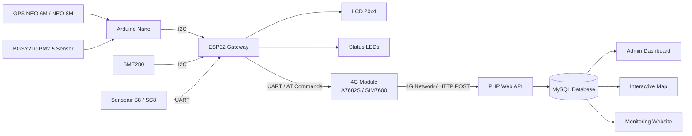

# 🚌 IoT-Based Bus Air Quality Monitoring System


An IoT-based environmental monitoring system designed to measure and monitor air quality inside buses while simultaneously tracking the vehicle's GPS position.

The system collects environmental data from multiple sensors, processes the measurements using ESP32 and Arduino Nano, and transmits the data to a remote web server through a 4G cellular network.

The collected data is stored in a MySQL database and displayed on a web-based monitoring platform with an interactive map, real-time environmental parameters, journey tracking, configurable warning thresholds, and system administration features.

---

# 📹 Project Demo

[](https://youtu.be/5acOrsV7Hrk)

▶️ **YouTube Demo:**  
https://youtu.be/5acOrsV7Hrk

---

# 🌐 Live Website

The monitoring system includes a complete web application for viewing environmental data and bus route information.

🌍 **Website:**  
https://webthongso.online

The website provides:

- Real-time environmental monitoring
- GPS route visualization
- Air quality monitoring along the bus journey
- Administrative dashboard
- Configurable data transmission interval
- Configurable air quality thresholds
- Historical measurement data
- Journey management
- Interactive map using Leaflet and OpenStreetMap

---

# 📌 Project Overview

The system is designed to monitor air quality inside a moving bus.

Environmental sensors continuously collect:

- Temperature
- Humidity
- Atmospheric pressure
- CO₂ concentration
- PM2.5 concentration
- GPS coordinates

The system uses two main controllers:

### Arduino Nano

The Arduino Nano is responsible for collecting:

- GPS coordinates
- GPS satellite information
- PM2.5 concentration

The collected data is packed into a data frame and transmitted to the ESP32 through I2C communication.

### ESP32 Gateway

The ESP32 acts as the main controller and communication gateway.

It is responsible for:

- Reading temperature, humidity, and atmospheric pressure
- Reading CO₂ concentration
- Receiving GPS and PM2.5 data from Arduino Nano
- Displaying sensor information on an LCD
- Monitoring sensor status
- Managing status LEDs
- Communicating with the 4G module
- Sending measurement data to the web server
- Receiving system configuration from the server

The complete data is transmitted to the web server through the cellular network using HTTP communication.

---

# 🏗️ System Architecture



---

# 🔄 Data Flow

The complete data flow of the system is:

```text
GPS + PM2.5 Sensor
        │
        ▼
   Arduino Nano
        │
        │ I2C
        ▼
      ESP32
        ▲
        │
 ┌──────┴─────────┐
 │                │
BME280       Senseair S8
 │                │
 └──────┬─────────┘
        │
        ▼
 Complete Sensor Data
        │
        ▼
   4G Module
        │
        │ Cellular Network
        ▼
   HTTP POST Request
        │
        ▼
     PHP API
        │
        ▼
  MySQL Database
        │
   ┌────┴───────────┐
   │                │
   ▼                ▼
Dashboard      Interactive Map
```

---

# 📊 Monitored Parameters

| Parameter | Sensor / Module |
|---|---|
| Temperature | BME280 |
| Humidity | BME280 |
| Atmospheric Pressure | BME280 |
| CO₂ Concentration | Senseair S8 / SC8 |
| PM2.5 | BGSY210 |
| Latitude | GPS NEO-6M / NEO-8M |
| Longitude | GPS NEO-6M / NEO-8M |
| GPS Satellites | GPS Module |
| GPS Accuracy | GPS Module |

---

# 🔧 Hardware Components

| Component | Function |
|---|---|
| ESP32 DevKit32 V1 | Main controller and IoT gateway |
| Arduino Nano | Secondary sensor acquisition controller |
| BME280 | Temperature, humidity, and atmospheric pressure sensor |
| Senseair S8 / SC8 | CO₂ concentration sensor |
| BGSY210 | PM2.5 particulate matter sensor |
| GPS NEO-6M / NEO-8M | Vehicle position tracking |
| A7682S / SIM7600 | 4G cellular communication |
| LCD 20x4 I2C | Local environmental data display |
| Status LEDs | Network, GPS, and sensor status indication |
| Custom PCB | Hardware integration and system connection |

---

# 🔌 Hardware Communication

## Arduino Nano → ESP32

The Arduino Nano collects GPS and PM2.5 data.

Communication between Arduino Nano and ESP32 is implemented using the I2C protocol.

The transmitted information includes:

- GPS validity status
- PM2.5 sensor status
- Number of GPS satellites
- Latitude
- Longitude
- GPS HDOP
- PM2.5 concentration
- Data sequence number
- Checksum

This architecture allows the Arduino Nano to handle GPS and particulate matter sensors while the ESP32 focuses on system management and Internet communication.

---

## BME280 → ESP32

Communication protocol:

```text
I2C
```

ESP32 pins:

```text
SDA: GPIO 21
SCL: GPIO 22
```

The BME280 provides:

- Temperature
- Humidity
- Atmospheric pressure

---

## Senseair S8 / SC8 → ESP32

Communication protocol:

```text
UART
```

Connection:

```text
ESP32 RX: GPIO 26
ESP32 TX: GPIO 27
Baud Rate: 9600
```

The sensor provides real CO₂ concentration measurements.

---

## 4G Module → ESP32

Communication protocol:

```text
UART + AT Commands
```

Connection:

```text
ESP32 RX: GPIO 16
ESP32 TX: GPIO 17
Baud Rate: 115200
```

The 4G module provides Internet connectivity for transmitting measurement data to the remote server.

---

# 📡 Internet Communication

The ESP32 communicates with the web server through the 4G cellular network.

The main communication flow is:

```text
ESP32
   ↓
UART
   ↓
4G Module
   ↓
Mobile Network
   ↓
Internet
   ↓
HTTP POST
   ↓
PHP API
   ↓
MySQL Database
```

The ESP32 periodically creates an HTTP request containing the latest environmental and GPS information.

Example transmitted data includes:

```text
device_id
temperature
humidity
pressure
co2
pm25
latitude
longitude
```

The server processes the request and stores the data in the database.

---

# 🌐 Web Monitoring System

The project includes a complete web-based monitoring system developed using:

- PHP
- MySQL
- HTML
- CSS
- JavaScript
- AJAX
- Leaflet.js
- OpenStreetMap

The website is responsible for receiving, storing, processing, and displaying data collected from the monitoring device.

---

# 🖥️ Monitoring Dashboard

The monitoring dashboard displays the latest environmental parameters collected from the device.

The monitored information includes:

- Temperature
- Humidity
- Atmospheric pressure
- CO₂ concentration
- PM2.5 concentration
- GPS coordinates
- Air quality status

The interface can automatically update data without requiring the user to manually reload the page.

---

# 🗺️ GPS Route and Air Quality Map

The system uses:

- Leaflet.js
- OpenStreetMap

to display the bus journey on an interactive map.

GPS positions collected during the journey are stored in the MySQL database.

The system can:

- Display measurement locations
- Connect GPS points to create the bus route
- Show environmental information at each location
- Display PM2.5 information
- Display CO₂ concentration
- Display temperature and humidity
- Visualize air quality changes along the journey

Users can interact with points on the map to view detailed environmental measurements recorded at specific locations.

---

# ⚙️ Administrative Dashboard

The website contains an administration interface for system management.

The administrator can:

- View current sensor data
- Monitor system status
- Configure data transmission intervals
- Configure environmental warning thresholds
- Manage stored journey data
- Delete old measurement data
- End the current journey
- Start a new monitoring journey

---

# ⏱️ Configurable Data Transmission Interval

The data transmission interval can be configured directly from the web administration interface.

The ESP32 can retrieve the configured interval from the server and automatically adjust the data transmission frequency.

This allows the monitoring frequency to be changed without modifying and uploading the ESP32 firmware again.

---

# 🚨 Air Quality Threshold Configuration

The system supports configurable environmental warning thresholds.

Administrators can modify the threshold values directly from the website.

The system can monitor environmental parameters and determine whether the measured air quality exceeds the configured safe limits.

This feature allows the monitoring system to adapt to different environmental monitoring requirements.

---

# 🚌 Journey Management

The system supports multiple monitoring journeys.

When a journey ends, the administrator can use the web interface to clear previous journey data.

This prevents old GPS routes from overlapping with new journeys on the map.

The journey management process is:

```text
Start Journey
     ↓
Collect Environmental Data
     ↓
Store GPS and Sensor Data
     ↓
Display Route on Map
     ↓
End Journey
     ↓
Clear Previous Journey Data
     ↓
Start New Journey
```

---

# 💡 Local LCD Display

The system uses a 20x4 I2C LCD for local monitoring.

The LCD displays important information such as:

```text
Latitude / Longitude

Temperature
Humidity
Pressure

CO2

PM2.5
```

This allows environmental information to be monitored directly from the device without accessing the website.

---

# 🚦 Status Indicators

The hardware includes status LEDs for displaying system conditions.

### Network LED

Indicates successful cellular network registration.

### GPS LED

Indicates when the GPS module has successfully acquired a valid position.

### Error LED

Flashes when a sensor or system error is detected.

---

# 💻 Technologies Used

## Embedded Systems

- C
- C++
- Arduino Framework
- ESP32
- Arduino Nano

## Communication Protocols

- I2C
- UART
- HTTP
- AT Commands

## Network

- 4G Cellular Network
- HTTP POST

## Backend

- PHP
- MySQL

## Frontend

- HTML
- CSS
- JavaScript
- AJAX

## Mapping

- Leaflet.js
- OpenStreetMap

## PCB Design

- Altium Designer

## Version Control

- Git
- GitHub

---

# 📂 Project Structure

```text
iot-bus-air-quality-monitoring/
│
├── GPS_khongkhi/
│   │
│   ├── admin/
│   │   └── Web administration interface
│   │
│   ├── api/
│   │   └── API endpoints for device-server communication
│   │
│   ├── assets/
│   │   ├── CSS
│   │   ├── JavaScript
│   │   └── Web resources
│   │
│   ├── includes/
│   │   └── Backend configuration and shared functions
│   │
│   └── Web monitoring application
│
├── code/
│   │
│   ├── ESP32 firmware
│   └── Arduino Nano firmware
│
├── mach/
│   │
│   ├── Schematic design
│   └── PCB design
│
├── .gitignore
│
└── README.md
```

---

# 🔐 Security

Sensitive information should never be publicly committed to GitHub.

The following information should be excluded from the repository:

- Database passwords
- Server passwords
- API keys
- Authentication tokens
- Private configuration files
- Hosting credentials

Sensitive files should be excluded using:

```text
.gitignore
```

Example:

```gitignore
config.php
**/config.php
.env
.env.*
*.db
*.sqlite
```

---

# 🚀 System Workflow

The complete system workflow is:

```text
1. Sensors measure environmental conditions

2. Arduino Nano reads:
   - GPS
   - PM2.5

3. Arduino Nano sends data to ESP32 through I2C

4. ESP32 reads:
   - Temperature
   - Humidity
   - Atmospheric pressure
   - CO2

5. ESP32 combines all sensor information

6. Data is displayed on the LCD

7. ESP32 communicates with the 4G module

8. Data is transmitted to the server using HTTP

9. PHP API receives the data

10. Data is stored in MySQL

11. Website retrieves the latest measurements

12. Environmental parameters are displayed on the dashboard

13. GPS data is displayed on the interactive map

14. Administrators can configure system parameters from the website
```

---

# 🎯 Project Objectives

The main objectives of this project are:

- Develop a mobile air quality monitoring system
- Monitor environmental conditions inside buses
- Track environmental data according to GPS location
- Transmit data using a cellular network
- Store environmental data on a remote server
- Develop an interactive web monitoring platform
- Visualize pollution levels along bus routes
- Support configurable system parameters
- Provide a complete IoT monitoring solution

---

# 🌍 Applications

This system can be applied to:

- Public buses
- School buses
- Passenger transportation
- Public transportation monitoring
- Mobile air quality measurement stations
- Smart city systems
- Urban pollution monitoring
- Environmental research

---

# 🔮 Future Improvements

Future developments may include:

- Real-time WebSocket communication
- Mobile application development
- Multiple bus monitoring
- User account management
- Automatic email notifications
- Mobile push notifications
- Historical data charts
- Advanced data analytics
- Cloud server deployment
- Air pollution prediction using Machine Learning
- OTA firmware updates
- Remote device management
- Multiple device support
- Real-time fleet monitoring

---

# 📹 Demo Video

A complete demonstration of the project is available on YouTube.

The video demonstrates:

- Complete hardware system
- Sensor data acquisition
- GPS positioning
- PM2.5 measurement
- CO₂ measurement
- LCD data display
- 4G data transmission
- Web monitoring dashboard
- GPS route visualization
- Interactive air quality monitoring

[](https://youtu.be/5acOrsV7Hrk)

▶️ **Watch Demo:**  
https://youtu.be/5acOrsV7Hrk

---

# 🌐 Project Website

The project's monitoring website is available at:

🌍 **https://webthongso.online**

The website provides real-time environmental monitoring, GPS route visualization, air quality information, system configuration, and journey management.

---

# 👨‍💻 Author

**Tran Dang Nam**

Embedded Systems & Internet of Things Project

GitHub:

[trandangnam030202-jpg](https://github.com/trandangnam030202-jpg)

Project Repository:

[IoT Bus Air Quality Monitoring System](https://github.com/trandangnam030202-jpg/iot-bus-air-quality-monitoring)

---

# ⭐ Support

If you find this project interesting or useful, please consider giving the repository a ⭐.
